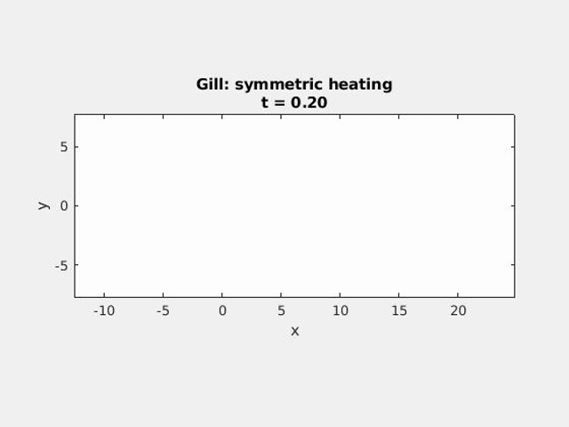

# GillModel
A numerical model of atmospheric general circulation on the tropical beta-plane based on the Gill 1980 paper. It is the [solution](doc/gfd_final_2008_solution.pdf) to the problem #3 of the GFD final exam at Columbia University in 2008.

## Quickstart

Git-clone the Matlab codes:

    git clone git@github.com:wy2136/GillModel.git
  
Open Matlab and run the model:

    run

## Examples

* [Symmetric Heating](figs/Gill_sym.gif)
* [Asymmetric Heating](figs/Gill_asym.gif)
* [Symmetric + Asymmetric Heating](figs/Gill_sym_asym.gif)
* [Kelvin Wave](figs/KelvinWave.gif)
* [Free Wave Propogation of Gaussian-shape Initial Condition](figs/GaussPert.gif)
* [Matsuno Heating](figs/MatsunoHeating.gif)
* [Symmetric Heating with Gaussian shape in zonal direction](figs/Gill_sym_2.gif)
* [Delta Heating at y=1](figs/Gill_sym_delta.gif)

## References

Gill, A. E. (1980), [Some simple solutions for heat‐induced tropical circulation](https://doi.org/10.1002/qj.49710644905). Q.J.R. Meteorol. Soc., 106: 447-462. doi:10.1002/qj.49710644905

## Links
[APPH G4410 - Geophysical Fluid Dynamics - Spring 2008](https://www.ldeo.columbia.edu/~spk/Classes/APPH4210_GFD/2008/gfd2008.html)
